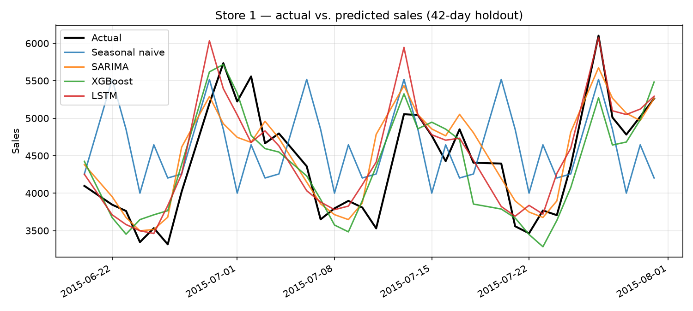
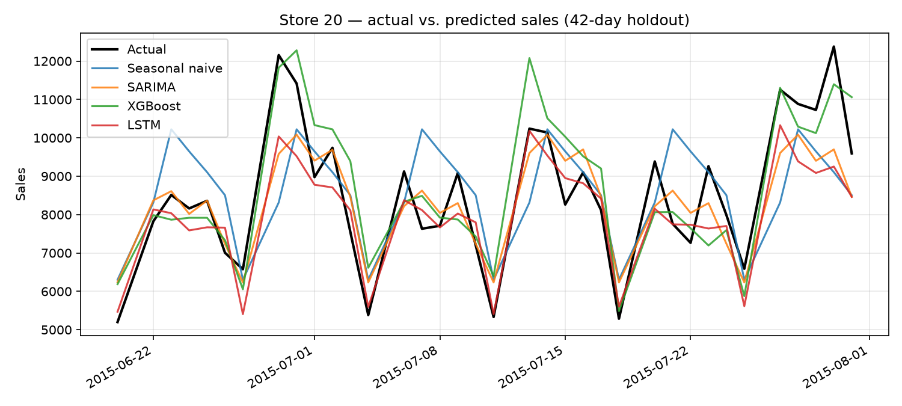
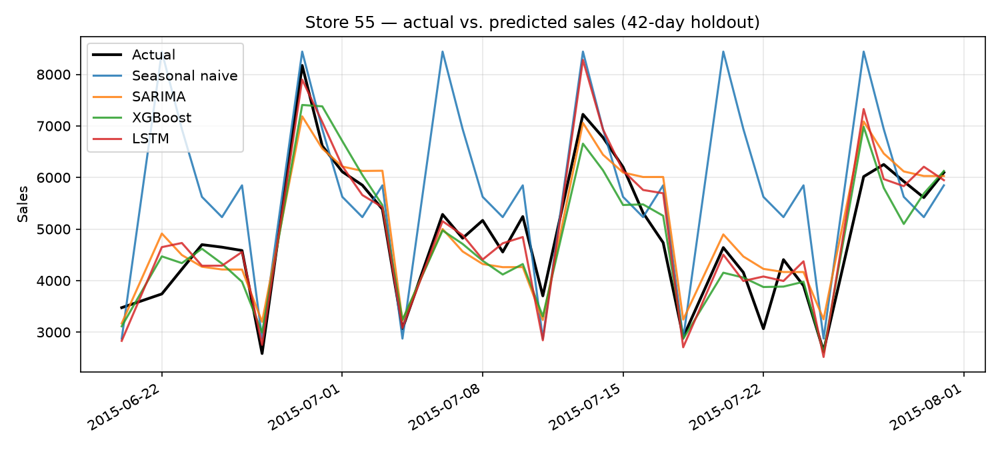

# 📈 Demand Forecasting for Retail — Beyond a Single Model

> A retail demand forecasting project that doesn't stop at "here's my model" — it asks which forecasting approach actually earns its keep, and shows the trade-off in plain numbers.

---

## 🔍 The Problem

A retail chain with over a thousand stores needs to know, every day, roughly how much each store will sell over the next six weeks. Get it wrong and the business either runs out of stock and loses sales, or overstocks and ties up cash in inventory that has to be discounted later.

The classical approach is a separate time-series model per store. It works, but it's slow to maintain at scale and it never learns from patterns in other stores.

This project asks a more useful question than "can I forecast sales":
> **Does a single global machine-learning model, trained across every store at once, actually beat a proper per-store classical baseline — and by how much?**

---

## ✨ What Makes This Project Different

| Typical Forecasting Project | This Project |
|---|---|
| One model, one metric | **Three model families head-to-head** — classical (SARIMA), tree-based (XGBoost), deep learning (LSTM) |
| Reports accuracy on training data | Held-out **42-day future window**, matching the real forecasting task |
| Ignores data leakage | Every feature is **shifted past the forecast horizon** — no peeking at the future |
| Picks a "winner" model | Reports where **each model actually wins** — MAPE vs RMSE tell different stories here |
| One-off script | **Reproducible CLI** (`python -m src.run_benchmark`) with a store-count and epoch dial for fast iteration |
| Numbers with no context | Every metric is **explained in plain language**, not just reported |

---

## 📦 Dataset

- **Name:** Rossmann Store Sales
- **Source:** [Kaggle — Rossmann Store Sales](https://www.kaggle.com/c/rossmann-store-sales)
- **Size:** ~1,115 stores, ~2.5 years of daily sales (2013–2015), ~1M rows
- **Key columns:** `Store`, `Date`, `Sales`, `Open`, `Promo`, `StateHoliday`, `SchoolHoliday`, `StoreType`, `Assortment`, `CompetitionDistance`

> Download `train.csv` and `store.csv` from Kaggle (accept the competition rules first) and place both in `data/raw/`.

---

## 🛠️ Tech Stack

| Library | Purpose |
|---|---|
| `pandas` / `numpy` | Loading the store×date grid, feature engineering |
| `statsmodels` | SARIMAX — the classical per-store baseline |
| `xgboost` | Global gradient-boosted tree model |
| `torch` | Global 2-layer LSTM with a promo/holiday-aware head |
| `scikit-learn` | Encoding, train/test utilities |
| `joblib` | Parallel per-store SARIMA fitting |
| `matplotlib` | Actual vs. predicted forecast plots |
| `tabulate` | Markdown benchmark table output |

---

## 📁 Project Structure

```
demand-forecasting-retail/
│
├── data/raw/                    ← Place train.csv and store.csv here (not pushed to GitHub)
├── results/                     ← Auto-generated benchmark.csv / benchmark.md
├── screenshots/                 ← Forecast-vs-actual plots (from plot_results.py)
│
├── src/
│   ├── config.py                 ← Horizon, eval-store count, seed
│   ├── data.py                   ← Load Rossmann into a complete store×date grid, time-based split
│   ├── features.py                ← Leak-free lag / rolling / calendar features
│   ├── metrics.py                 ← MAPE, RMSE, RMSPE, benchmark table with % improvement
│   ├── run_benchmark.py           ← End-to-end CLI runner
│   ├── plot_results.py            ← Saves actual-vs-predicted charts per store
│   └── models/
│       ├── baseline.py            ← Seasonal-naive sanity floor
│       ├── sarima.py              ← Per-store SARIMAX baseline
│       ├── xgb.py                 ← Global XGBoost model
│       └── lstm.py                ← Global LSTM model
│
├── requirements.txt
└── README.md                    ← This file
```

---

## ▶️ How to Run

**1. Install dependencies**

```bash
python -m venv .venv && source .venv/bin/activate
pip install -r requirements.txt
```

**2. Download the dataset**

Get `train.csv` and `store.csv` from [Kaggle](https://www.kaggle.com/c/rossmann-store-sales/data) and place them in `data/raw/`.

**3. Run the benchmark**

```bash
python -m src.run_benchmark                                  # full run, all 4 models
python -m src.run_benchmark --skip-lstm                      # skip LSTM (no torch needed)
python -m src.run_benchmark --n-stores 10 --lstm-epochs 3     # quick test
```

> ⚠️ Run from the repo root, using `-m src.run_benchmark` — this makes the package imports inside `src/` resolve correctly.

Results are written to `results/benchmark.csv` and `results/benchmark.md`.

**4. (Optional) Generate forecast plots**

```bash
python -m src.plot_results --stores 1 20 55
```

Saves one PNG per store to `screenshots/`, plotting actual sales against every model's prediction over the holdout window.

---

## ⚖️ The Evaluation Protocol

This is the part most demand-forecasting projects skip, and it's the part that makes the numbers trustworthy:

- **Time-based split**, not random — the last 42 days of the data are held out, because that's how forecasting actually works: you only ever have the past to predict the future.
- **No leakage** — every lag and rolling-mean feature is shifted by at least 42 days, so a validation row only uses information that existed at the moment the forecast was made.
- **Closed days masked out** — a store closure looks like a sales crash if you don't handle it; closed days are excluded from the lag/rolling inputs so they don't get mistaken for falling demand.
- **Same evaluation points for every model** — all four models are scored on the same stores, the same days, and only days the store was open (MAPE is undefined at zero sales).
- **A fair baseline** — SARIMA gets the same Promo/holiday information the other models get, so it isn't handicapped on purpose.

---

## 📊 Results

60 evaluation stores · 42-day holdout (2015-06-20 → 2015-07-31) · 2,166 scored store-days

| Model | MAPE (%) | RMSE | RMSPE (%) | MAPE improvement vs SARIMA | RMSE improvement vs SARIMA |
|---|---|---|---|---|---|
| Seasonal naive | 24.01 | 2112.15 | 35.15 | -139.6% | -113.5% |
| **SARIMA** (baseline) | 10.02 | 989.28 | 13.15 | — | — |
| **XGBoost** | 9.04 | 859.38 | 11.85 | **+9.75%** | **+13.13%** |
| **LSTM** | 8.68 | 872.51 | 11.47 | **+13.40%** | **+11.80%** |

**What these numbers actually mean:**

- **MAPE** is the average forecast error as a percentage of that day's true sales. SARIMA is off by about 1/10th of true sales on an average day; both global models get closer — the LSTM's 8.68% means its typical miss is nearly a fifth smaller than SARIMA's.
- **RMSE** is the typical error in raw sales units, but it punishes large misses much harder than small ones. XGBoost has the lowest RMSE, meaning it makes the fewest big mistakes on high-volume stores — narrowly ahead of the LSTM here, even though the LSTM has the better MAPE. That split is the real finding of this project (see below).
- **RMSPE** is the official metric the original Kaggle competition was scored on, included so these results sit in a familiar frame of reference.
- **"Improvement vs SARIMA"** turns raw error into a business-readable number: XGBoost's +9.75% MAPE improvement means `(10.02 − 9.04) / 10.02`. The seasonal-naive row is negative on purpose — it's a sanity floor, and confirms SARIMA is genuinely learning structure beyond "repeat last week."

**The headline takeaway:** both global models beat the per-store SARIMA baseline on every metric. Neither global model wins outright over the other — XGBoost is better at avoiding large misses (RMSE), the LSTM is better on average percentage accuracy (MAPE, RMSPE). The real result isn't "model X wins," it's that **a single global model, trained once across 1,115 stores, outperforms a classical model fit separately to each one** — which is exactly the scalability argument that matters at a company with thousands of stores.

**Caveats, in the interest of not overselling this:**

- One run, one seed, one 42-day window, 60 of 1,115 stores evaluated — the ~1.6% RMSE gap between XGBoost and the LSTM is small enough that a different seed could flip it.
- XGBoost and the LSTM are trained on all 1,115 stores; SARIMA only ever sees the 60 stores it's scored on — the standard way to compare global vs. per-series models, but worth stating plainly.
- This is not the official Kaggle test set (those labels aren't public), so these RMSPE numbers aren't directly comparable to the public leaderboard.

---

## 📉 Sample Forecasts

Actual vs. predicted sales for three stores over the 42-day holdout window:





The gap between the black actual line and each model's line is the same error the benchmark table above summarizes as MAPE/RMSE — this is what that error looks like day by day, not just as a single averaged number.

---

## 🧠 Key Insights

- A **single global model beats per-store classical forecasting** here — the practical implication is that one model can plausibly replace 1,115 separately maintained SARIMA fits.
- **MAPE and RMSE disagree** on which global model is "best," and that's not a bug — it reflects a real trade-off between average accuracy and large-miss risk that a retailer would care about differently depending on whether stockouts or overstock are more costly.
- **Closed-day masking mattered**: treating store closures as "missing" rather than "zero demand" in the lag features measurably improved the tree-based model's error.
- **Promo and holiday flags, known in advance**, are what let all three real models beat the seasonal-naive floor by more than half — calendar-aware features carry more signal here than the raw sales history alone.

---

## 🚀 Future Improvements

- **Store-segment breakdown** — report MAPE/RMSE separately by `StoreType` to see whether XGBoost and the LSTM win for different kinds of stores.
- **More seeds** — rerun the LSTM with 2–3 seeds to check whether its edge over XGBoost is stable or noise.
- **Ensemble** — average the XGBoost and LSTM forecasts; the two models make different kinds of errors, so a blend could beat both.
- **Business framing** — attach an actual over/understock cost per unit, the way a cost-sensitive model turns raw accuracy into a dollar figure, to turn "9.75% lower MAPE" into a rupee number the way a stakeholder would ask for.
- **Deploy** — wrap the best model behind a small API or Streamlit app that returns a 6-week forecast for a given store.

---

## 🧠 What I Learned

Benchmarking taught me that "best model" isn't a single number — MAPE and RMSE told genuinely different stories here, and picking one over the other is itself a business decision, not just a modeling one. I also learned how much of a time-series project's credibility comes from the evaluation protocol rather than the model: leak-free features and a proper time-based holdout mattered more to the final numbers than any amount of model tuning would have.

---

## 👤 Author

**Shanvi Agarwal**  
📎 [LinkedIn](https://www.linkedin.com/in/shanvi-agarwal-93b38928b/)  
🐙 [GitHub](https://github.com/SanviAgarwal)